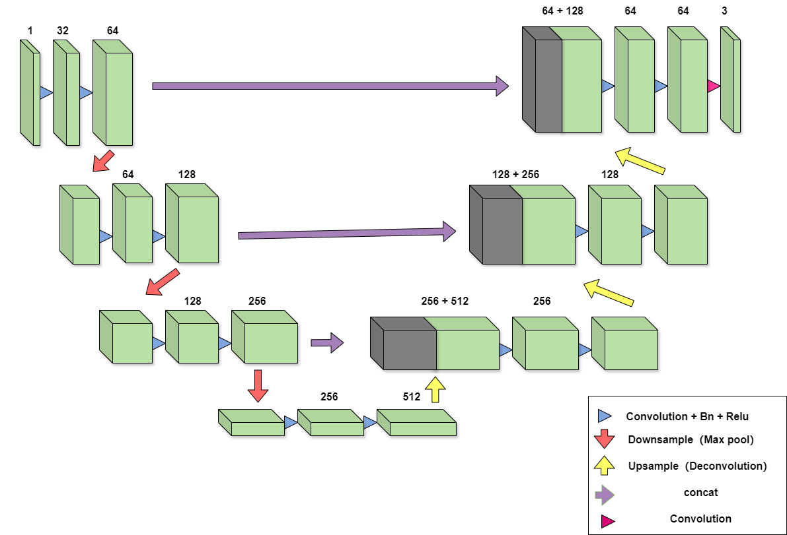
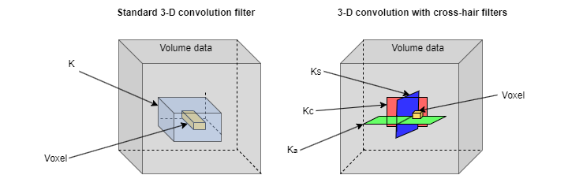

# Deep Learning-Based Segmentation of Pulmonary Vessels in Chest CT Scans for Improved Vascular Disease Detection

This project aims to apply deep learning to medical image processing to solve the problem of vascular segmentation in lung CT images. 3D U-Net will be used as the deep learning network in the experiment, and a two-dimensional cross-hair filter is used to accelerate the training and inference speed of the network.

## 3D U-Net

The code implementation of this network architecture is stored in the unet3d.py file, which references Amir Aghdam's implementation scheme and can be obtained via the following link.
> Link to the repository: [https://github.com/amir-aghdam/3D-UNet/tree/main](https://github.com/amir-aghdam/3D-UNet/tree/main)

### Model Architecture
The network consists of two parts: an encoder and a decoder, with a depth of four. It has one input channel, which is a CT grey image, and three output channels, each representing a class. Each dimension of the input data size can be divided by 16 to prevent decimals from appearing during the downsampling process.

<p align="center">
  
</p>

## Two-dimensional Cross-hair Filter
The implementation code for this filter is stored in layer.py. It is included in a custom convolution layer and replaces the ordinary convolution layer in U-Net.
> This code references Giles Tetteh's repository: [https://github.com/giesekow/deepvesselnet/tree/master/dvn](https://github.com/giesekow/deepvesselnet/tree/master/dvn)

### Filter Architecture
This filter uses three orthogonal two-dimensional convolution kernels instead of three-dimensional convolution kernels, reducing the number of parameters and improving operational efficiency while utilizing three-dimensional contextual information to ensure the accuracy of the results.

<p align="center">
  
</p>

## Installing
Use the following code to create the environment and install dependencies.
```
conda create -n 3DUNET_ch python=3.10.3
conda activate 3DUNET_ch
pip install -r requirements.txt
```

## Datasets
The data used in the experiment comes from the public HiPaS dataset. It consists of 250
cases, each containing a raw CT intensity map and corresponding artery and vein annotations.
Each image has a length and width of (512, 512) and a depth between 256 and 300. This dataset can be viewed and downloaded at the [Zenodo link](https://zenodo.org/records/14879605).
If you want to open CT data and annotations, you can use the following code:
```
ct = np.load(".\ct_scan\001.npz", allow_pickle=True)["data"]
artery = np.load(".\annotation\artery\001.npz", allow_pickle=True)["data"]
vein = np.load(".\annotation\vein\001.npz", allow_pickle=True)["data"]
```


## Run training
Before training begins, you need to change the configuration and hyperparameters in config.py. Their meanings are annotated in the file. After configuration is complete, the original 3D U-Net network can be trained using the following code.

```
python train_noch.py
```

The following code is used to train a 3D U-Net network that applies the two-dimensional cross-hair filter.

```
python train_ch.py
```
## Run the test
After training, you can obtain the checkpoint file for saving the model. Run the following code to obtain the results on the test set and the evaluation score. To original 3D U-Net:
```
python test_noch.py
```
To 3D U-Net network that applies the two-dimensional cross-hair filter:
```
python test_ch.py
```


## Run post-processing
For the model's prediction results, post-processing is used to connect the breakpoints and further improve connectivity. The process is run using command-line tools. An example is:
```
python postprocessing/reconnect_vessels.py --in_path input.nii.gz --out_path output.nii.gz --min_size 200 --close_steps 2 --near_main_mm 3.0 --corridor_mm 2.0 --corridor_dilate 2 --skel_iters 6
```
The necessary parameters are the input and output file names, both of which are .nii.gz type files. The remaining parameter information can be viewed by entering:
```
python postprocessing/reconnect_vessels.py -h
```
The post-processing test is saved in postprocessing\test_connection.py. In this file, set the file paths before and after reconnection, as well as the ground truth file path. Run the test using the following code:
```
python postprocessing/test_connection.py
```


